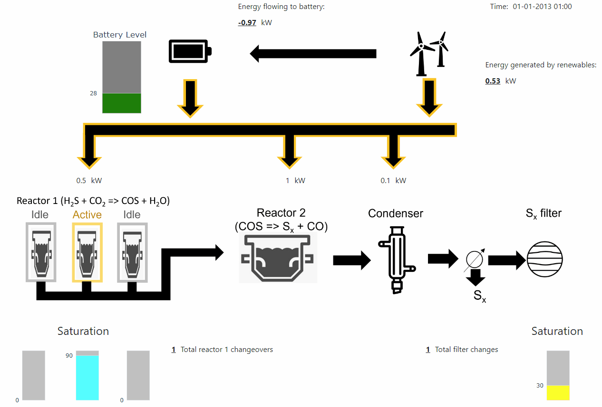
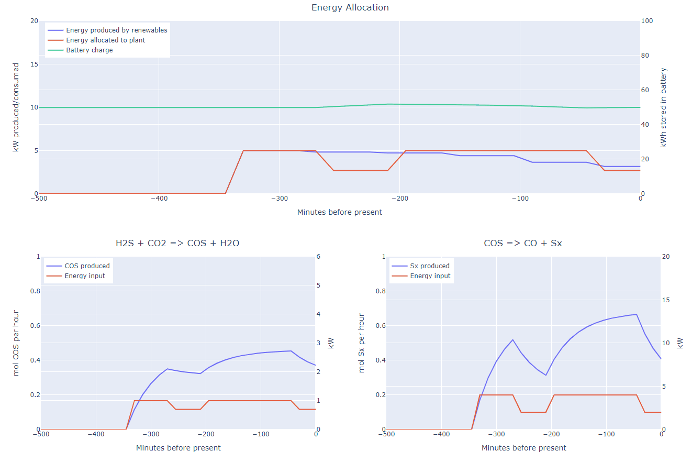

# Reactor-Dash-App
## Introduction
This is a Dash app created to model a series of reactors powered by renewable energy sources, using real 
weather data and a model plant containing a system of reactors, a condenser, and filter. The top 
half of the app shows a visual representation of how the energy is allocated to a battery and 
the different plant components. Battery charge, reactor saturation levels, and a sulfur filter 
saturation level are also shown in the model. Figure 1 below shows an example for a period in 
early January 2013.

<i>Figure 1: Example of energy allocation and reactor saturation graphic.</i>

 

Below the energy allocation graphic are several graphs, shown in Figure 2. The top shows the 
energy generated by renewables, the battery charge, and the amount of energy consumed by the 
plant. The bottom two graphs show energy input and product output as a function of time. The time
constant was deliberately chosen to show an exagerated transient curve; this is unlikely to be
representative of the eventual reactor. Also note that the product output calculation currently 
uses estimated equations for steady state kinetics, so the stoichiometry does not always align 
in this example. Steady state curves are shown at the bottom of the app (not pictured here). A detailed
explaination of the equations used for this model are described later in this document.

<i>Figure 2: Graphs for tracking energy allocation and product output with time.</i>

 

## Instructions
To run, follow the steps below:
* Save app.py, dashboard_components.py, plant_components.py, weather_energy_components.py,
wind_solar_2013-2022_open-meteo.com.csv, and the assets folder in the same location.
* Run app.py
* In the console, a message will appear similar to "Dash is running on http://127.0.0.1:XXXX/".
Copy the address into a browser window.  
  
The dashboard will appear in the browser window, updating every 300ms to show the energy flows
and COS/Sulfur production at different time points.

# Description of model
## Summary
The model assumes a system setup that includes an energy source consisting of solar panels and 
wind turbines, a battery for energy storage, a collection of three identical sub-reactors 
(collectively known as “Reactor 1”), a fluidized bed reactor (known as “Reactor 2”), a 
condenser, and a sulfur filter. The energy generated is allocated to Reactor 1, Reactor 2, and 
the condenser, and any excess energy or low production is modulated by the battery.  

## Energy generation
The model takes real historical weather data in hourly intervals as input. The energy generated 
from the sun and wind is calculated by equations (1) and (2) respectively, and the total 
renewable energy generation is the sum of these, as shown in equation (3).  

$$e_{sp,t} = \dfrac{c_{sp} \times a_{sp} \times e_{sr,t}}{1000}\$$ 

(1)

$$
e_{wt,t} = 
\begin{cases}
\begin{array}{ll}
0 & \quad \text{if } w_t > w_{cut\mbox{-}out} \\
  & \quad \text{or } w_t < w_{cut\mbox{-}in}\\
e_{wt}^{max} & \quad \text{if } w_{rated} < w_t \leq w_{cut\mbox{-}out}\\
e_{wt}^{max} \left( \dfrac{w_t - w_{cut\mbox{-}in}}{w_{rated} - w_{cut\mbox{-}in}} \right) 
& \quad \text{if } w_{cut\mbox{-}in} \leq w_t \leq w_{rated}
\end{array}
\end{cases}
\$$

(2)

$$e_{renew,t} = e_{wt,t} + e_{sp,t}\$$

(3)

Where:
* $e_{sp,t}$ is the energy generated by solar panels at time _t_.
* $c_{sp}$ is an efficiency factor, taken to be 0.1.
* $a_{sp}$ is the area of the solar panels, taken to be 1,000 m2.
* $e_{sr,t}$ is the solar radiation at _t_.
* $e_{wt,t}$ is the energy generated by wind turbines at time _t_.
* $e_{wt}^{max}$ is the maximum energy that can be generated by the wind turbines, taken to be 5 kW.
* $w_t$ is wind speed at time _t_.
* $w_{cut\mbox{-}out}$ is the maximum windspeed at which the wind turbines can be operated, taken to be 100 km/hr.
* $w_{cut\mbox{-}in}$ is the minimum windspeed at which the wind turbines can be operated, taken to be 13 km/hr.
* $w_{rated}$ is the wind turbines’ rated windspeed, above which no extra energy is generated. This is taken to be 50 km/hr.
* $e_{renew,t}$ is the total energy generated by renewables at time _t_.

The solar energy generated ($e_{sp,t}$) is the product of the solar radiation ($e_{sr,t}$), the 
area of the solar panels ($a_{sp}$), and an efficiency factor ($c_{sp}$). As input data for solar 
radiation has the units of $\frac{W}{m^2}$ and energy flow in the plant is calculated in terms 
of kW, a correction factor of 1000 is used in equation (1).  
  
The relationship between windspeed ($w_t$) and the energy from wind turbines ($e_{wt,t}$) is 
separated into four regimes. When the windspeed is below the cut-in windspeed 
($w_{cut\mbox{-}in}$), no energy is generated. Between the cut-in windspeed and the wind 
turbines’ rated speed ($w_{rated}$), a linear relationship is assumed. Above the rated windspeed 
and lower than the cut-out windspeed, the generated energy remains flat at ($e_{wt}^{max}$). 
Above the cut-out windspeed, the wind turbines are no longer safe to operate and the energy 
generated is 0. 

## Energy Allocation
The energy allocation to the different components of the plant ($g_{r,t}$) is determined by the 
battery level and the renewable energy produced, and divided into four decision levels for each
plant component as described in equation (4). The energy allocated to the battery ($d_t^b$) is 
then determined by calculating the difference between the energy produced and the energy 
consumed by the plant components, shown in equation (5). If the energy demand of the plant 
components are higher than the energy produced, $d_t^b$ will be negative. This indicates that 
energy is flowing out of the battery and to the plant.  
  
The total battery charge at time _t_ is the sum of its charge at _t_-1 and the product of the 
energy flowing to it ($d_t^b$) and an efficiency factor ($c_b$) if $d_t^b$ is positive, otherwise
$d_t^b$ is simply subtracted from the battery's previous charge as shown in equation (6). The 
current model assumes a constant efficiency factor of 0.9, but in practice this is known to 
depend on the battery charge.

$$
g_{r,t} =
\begin{cases}
\begin{array}{ll}
d_{r,0} & \quad \text{if } \dfrac{b_t}{b^{max}} < b_0^e \\
  & \quad \text{or }  b_t + e_{renew,t} < \sum_{r \in R} d_{r,1}\\
d_{r,1} & \quad \text{if } b_0^e \leq \dfrac{b_t}{b^{max}} < b_1^e \\
d_{r,2} & \quad \text{if } b_1^e \leq \dfrac{b_t}{b^{max}} < b_2^e \\
d_{r,3} & \quad \text{if } \dfrac{b_t}{b^{max}} \geq b_2^e
\end{array}
\end{cases}
\$$

(4)

$$d_t^b=e_{renew,t}-\sum_{r\in R} g_{r,t} \$$

(5)

$$
b_t=
\begin{cases}
\begin{array}{ll}
b_{t-1}+c_b\times d_t^b & \text{if } d_t^b \geq 0 \\
b_{t-1}\times d_t^b & \text{if } d_t^b < 0
\end{array}
\end{cases}
\$$

(6)

Where:
* $g_{r,t}$ is the energy allocated to reactor _r_ at time _t_.
* $d_{r,j}$ is the pre-determined distribution of energy to reactor _r_ at energy level _j_. The values used in the model are shown in Table 1 below.
* $b_t$ is the energy stored in the battery at time _t_.
* $b^{max}$ is the maximum energy the battery can hold, taken to be 100 kWh.
* $b_j^e$ is the battery charge at energy level _j_. The values used in the model are shown below in Table 2.
* $d_t^b$ is the energy allocated to the battery at time _t_.
* $c_b$ is the efficiency factor for the battery, taken to be 0.9.

 
<table align="center">
  <thead font-weight="bold">
    <tr>
      <th colspan=2 rowspan=2>$d_{r,j}$ (kW)</th>
      <th colspan=4>Energy Level (j)</th>
    </tr>
    <tr>
      <th>j = 0</th>
      <th>j = 1</th>
      <th>j = 2</th>
      <th>j = 3</th>
    </tr>
    <tr>
      <td rowspan=2 font-weight="bold">Reactor (r)</td>
      <td font-weight="bold">r = r1 (reactor 1)</td>
      <td>0</td>
      <td>0.5</td>
      <td>0.7</td>
      <td>1</td>
    </tr>
    <tr>
      <td font-weight="bold">r = r2 (reactor 2)</td>
      <td>0</td>
      <td>1</td>
      <td>2</td>
      <td>4</td>
    </tr>
  </thead>
</table>

<i>Table 1: Distribution of energy (kW) to each reactor for each energy level</i>
  
 
 
  
<table align="center">
  <thead font-weight="bold">
    <tr>
      <th>$b_j^e$</th>
      <th>j = 0</th>
      <th>j = 1</th>
      <th>j = 2</th>
    </tr>
  </thead>
  <tbody>
    <tr>
      <td font-weight="bold">$\dfrac{b_t}{b^{max}}$ </td>
      <td>0.1</td>
      <td>0.3</td>
      <td>0.5</td>
    </tr>
  </tbody>
</table>

<i>Table 2: Battery charge as a ratio of total capacity for each energy level</i>
  
 
 

In this manner, the energy flowing to the plant components is always one of four discrete 
levels, determined primarily by the charge of the battery. In order to better simulate a real 
plant and ensure the energy flow does not get too unstable, the energy allocation is only 
allowed to change once per hour. Therefore, when the plant runs, one observes step changes 
between the energy levels at a maximum frequency of once per hour.

## Reactor 1 saturation
Reactor 1 consists of three sub-reactors, of which only one at a time is in the “active” state.
If a sub-reactor is active, it is converting a mixture of H2S and CO2 to COS and water. Within
each sub-reactor there is a catalyst that gradually becomes saturated with water, and this must
be cleaned once fully saturated. If a sub-reactor is in a being cleaned, it is in the 
“cleaning” state. If a reactor is neither producing COS or being cleaned, it is in the “idle” 
state.  
  
The model is designed such that once a reactor reaches saturation, it immediately switches 
state to “cleaning,” and another reactor changes states from “idle” to “active.” The saturation
of sub-reactor _i_ ($s_{r1,i,t}$) is given by equation (7).

$$
s_{r1,i,t}=
\begin{cases}
\begin{array}{ll}
s_{r1,i,t-1}+c_{r1\mbox{-}sat}\times p_{r1,t} & \quad \text{if } state_{r1,i,t}=\text{"active"} \\
s_{r1,i,t-1}-cl & \quad \text{if } state_{r1,i,t}=\text{"cleaning"} \\
0 & \quad \text{if } state_{r1,i,t}=\text{"idle"}
\end{array}
\end{cases}
\$$

(7)

Where:
* $s_{r1,i,t}$ is the saturation of sub-reactor _i_ at time _t_.
* $state_{r1,i,t}$ is the state of the sub-reactor.
* $c_{r1\mbox{-}sat}$ is a constant that relates the throughput (COS produced) to change in
saturation. This is taken to be 5 in the model.
* $p_{r1,t}$ is the moles of main product produced by r1 (in this case, COS) at time _t_. 
* $cl$ is the cleaning speed of the reactor. It is taken to be 10 in this model.

## Reaction kinetics
### Steady state
The steady state reaction kinetics in both reactors 1 and 2 are assumed to be sigmoidal 
functions of energy input. Equation (8) shows the function used in the model.  

$$p_{r,t}^{s\mbox{-}s}=\frac{m_{r,1}}{1+e^{m_{r,2}-g_{r,t}}}+m_{r,3}\$$

(8)

Where:
* $p_{r,t}^{s\mbox{-}s}$ is the steady state output of the main product from reactor _r_ at time _t_.
* $g_{r,t}$ is the energy allocated to reactor _r_ at time _t_.
* $m_{r,k}$ is a set of constants. The constants used in this model are shown in Table 3.

 
<table align="center">
  <thead font-weight="bold">
    <tr>
      <th>$m_{r,k}$</th>
      <th>k = 1</th>
      <th>k = 2</th>
      <th>k = 3</th>
    </tr>
  </thead>
  <tbody>
    <tr>
      <td font-weight="bold">r = reactor 1</td>
      <td>2</td>
      <td>1</td>
      <td>-0.54</td>
    </tr>
    <tr>
      <td font-weight="bold">r = reactor 2</td>
      <td>1</td>
      <td>3</td>
      <td>-0.05</td>
    </tr>
  </tbody>
</table>

<i>Table 3: Table showing the steady state constants used to create
  the sigmoidal functions in the model. Note that these constants were arbitrarily chosen; 
  we are waiting on more information before we can get a more accurate relationship.</i>
  
 
 

### Dynamic reaction
Although the steady state kinetics are necessary for the model, the system dynamics also must 
be taken into account. In the plant, it will likely take time for a reactor to change 
temperature once the energy input is changed, so the model uses time constants to account for 
this, as shown in equations (9) and (10) below.

$$\varepsilon_{r,t}=p_{r,t}^{s\mbox{-}s}-p_{r,t}\$$

(9)

$$
p_{r,t}=
\begin{cases}
\begin{array}{ll}
p_{r,t-1}+k_r^u\times\varepsilon_{r,t} & \quad \text{if } \varepsilon_{r,t}\geq 0 \\
p_{r,t-1}+k_r^d\times\varepsilon_{r,t} & \quad \text{if } \varepsilon_{r,t}<0
\end{array}
\end{cases}
\$$

(10)

Where:
* $\varepsilon_{r,t}$ is the error term that is the difference between the steady state 
calculation and the previous product output at time _t_-1.
* $p_{r,t}^{s\mbox{-}s}$ is the steady state output of the main product from reactor _r_ at 
time _t_.
* $p_{r,t}$ is the production of the main product from reactor _r_ at time _t_.
* $k_r^u$ is the time constant for increasing temperature in reactor _r_. This is taken to be 1 
for both reactors in the model.
* $k_r^d$ is the time constant for decreasing temperature in reactor _r_. This is taken to be 1 
for both reactors in the model.  

Note that here the model allows for different time constants depending on whether the temperature
is increasing or decreasing, as these may happen at different rates in practice. For simplicity,
this version of the model uses the same value (1) for all time constants.

## Sulfur filter saturation
Before the CO stream can flow out of the system, excess sulfur needs to be filtered out by the 
sulfur filter. Similar to reactor 1, it saturates at a rate proportional to the throughput. We 
make the assumption that the condenser has the same efficiency (i.e. condenses the same 
proportion of Sx) regardless of its input stream. Therefore, we assume the saturation of the 
sulfur filter is directly proportional to the Sx output from reactor 2.  
  
Unlike reactor 1, when the filter is saturated, it is replaced and not cleaned. Therefore, once
reaching 100% saturation, the model records a filter change and resets the saturation back to 
0. See equation (11).  

$$
s_{sf,t}=
\begin{cases}
\begin{array}{ll}
s_{sf,t-1}+c_{sf\mbox{-}sat}\times p_{r2,t} & \quad \text{if } s_{sf,t-1}+c_{sf\mbox{-}sat}\times p_{r2,t}\leq100 \\
c_{sf\mbox{-}sat}\times p_{r2,t} & \quad \text{if } s_{sf,t-1}+c_{sf\mbox{-}sat}\times p_{r2,t}>100
\end{array}
\end{cases}
\$$

(11)

Where:
* $s_{sf,t}$ is the saturation of the sulfur filter at time _t_.
* $c_{sf\mbox{-}sat}$ is the constant to relate Sx production to filter saturation. This is taken to be 3 in the model.
* $p_{r2,t}$ is the moles main product produced by r2 (in this case, Sx) at time _t_.  
  

The equation is set up in such a way so as to never allow the filter to surpass 100 saturation. 
If it the added sulfur ($c_{sf\mbox{-}sat}\times p_{r2,t}$) would cause the total saturation to
surpass 100 when added to the previous saturation level, $s_{sf,t-1}$ is taken to
be 0 and the next saturation value is effectively $0+c_{sf\mbox{-}sat}\times p_{r2,t}$.

