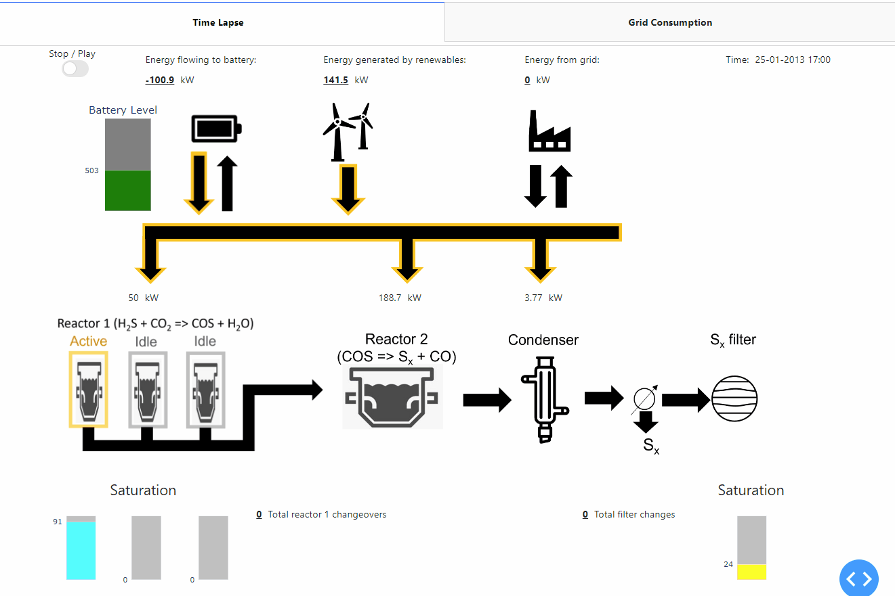
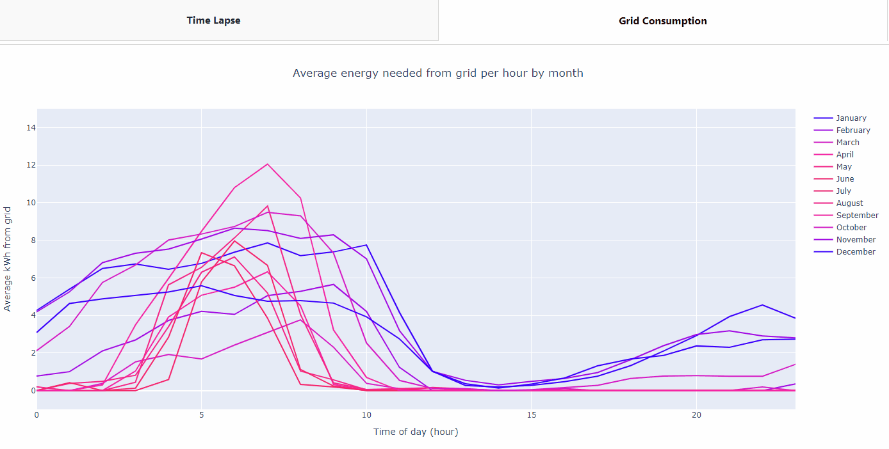

# Reactor-Dash-App
## Introduction
This is a Dash app created to model a series of reactors powered by renewable energy sources, using real 
weather data and a model plant containing a system of reactors, a condenser, and filter. The top 
half of the first tab in the app shows a visual representation of how the energy is allocated to a battery and 
the different plant components. Battery charge, reactor saturation levels, and a sulfur filter 
saturation level are also shown in the model. Figure 1 below shows an example for a period in January 2013.  

<i>Figure 1: Example of energy allocation and reactor saturation graphic.</i>

 

Below the energy allocation graphic are several graphs, shown in Figure 2. The top shows the 
energy generated by renewables, the battery charge, and the amount of energy consumed by the 
plant. The bottom graphs focus on the dynamics of the second reactor (the first reactor dynamics are not 
shown as it receives a constant power supply, and it's output mirrors that of the second reactor. 
Showing this graphically would be redundant). The bottom left graph shows the current steady-state production
as a function of energy input, and the bottom right graph shows energy input and product 
output for the second reactor as a function of time, accounting for a lagged effect due to time constants.  A detailed
explaination of the equations used for this model are described later in this document.  

<i>Figure 2: Graphs for tracking energy allocation and product output with time.</i>

 

The second tab contains an interactive graph (Figure 3) that shows the distributions of grid energy demand per hour by month. 
Winter months are colored blue, and this fades to red as the summer months approach.  

<i>Figure 3: Graph of the average energy grid demand per hour by month.</i>

 

Finally, the plant capex components and several process control constants are optimized by 
running multiple simulations in a DOE format and maximizing the predicted profitability for 
different configurations. The code and a detailed description of how this done is available in
[long_term_output.ipynb](long_term_output.ipynb).

## Instructions
To run the app, follow the steps below:
* Save app.py, dashboard_components.py, plant_components.py, weather_energy_components.py, input_specs.py,
wind_solar_2013-2022_open-meteo.com.csv, and the assets folder in the same location.
* Run app.py
* In the console, a message will appear similar to "Dash is running on http://127.0.0.1:XXXX/".
Copy the address into a browser window. This app was developed using Chrome.
  
The dashboard will appear in the browser window. The user can toggle the "stop / play" button to run
the simulation. When playing, the dashboard will update every 300ms to show the energy flows
and sulfur production at different time points.

# Description of model
## Summary
The model assumes a system setup that includes an energy source consisting of solar panels and 
wind turbines, a battery for energy storage, a collection of three identical sub-reactors 
(collectively known as “Reactor 1”), a fluidized bed reactor (known as “Reactor 2”), a 
condenser, and a sulfur filter. The energy generated is allocated to Reactor 1, Reactor 2, and 
the condenser, and any excess energy or low production is modulated first by the battery, then
via a connection to the grid.  

## Energy generation
The model takes real historical weather data in hourly intervals as input. The energy generated 
from the sun and wind is calculated by equations (1) and (2) respectively, and the total 
renewable energy generation is the sum of these, as shown in equation (3).  

$$e_{sp,t} = \dfrac{c_{sp} \cdot a_{sp} \cdot e_{sr,t}}{1000}\$$ 

(1)

$$
e_{wt,t} = 
\begin{cases}
\begin{array}{ll}
0 & \quad \text{if } w_t > w_{cut\mbox{-}out} \\
  & \quad \text{or } w_t < w_{cut\mbox{-}in}\\
e_{wt}^{max} & \quad \text{if } w_{rated} < w_t \leq w_{cut\mbox{-}out}\\
e_{wt}^{max} \left( \dfrac{w_t - w_{cut\mbox{-}in}}{w_{rated} - w_{cut\mbox{-}in}} \right) 
& \quad \text{if } w_{cut\mbox{-}in} \leq w_t \leq w_{rated}
\end{array}
\end{cases}
\$$

(2)

$$e_{renew,t} = e_{wt,t} + e_{sp,t}\$$

(3)

Where:
* $e_{sp,t}$ is the energy generated by solar panels at time _t_.
* $c_{sp}$ is an efficiency factor, taken to be 0.1.
* $a_{sp}$ is the area of the solar panels, taken to be 1,000 m2.
* $e_{sr,t}$ is the solar radiation at _t_.
* $e_{wt,t}$ is the energy generated by wind turbines at time _t_.
* $e_{wt}^{max}$ is the maximum energy that can be generated by the wind turbines, taken to be 5 kW.
* $w_t$ is wind speed at time _t_.
* $w_{cut\mbox{-}out}$ is the maximum windspeed at which the wind turbines can be operated, taken to be 100 km/hr.
* $w_{cut\mbox{-}in}$ is the minimum windspeed at which the wind turbines can be operated, taken to be 13 km/hr.
* $w_{rated}$ is the wind turbines’ rated windspeed, above which no extra energy is generated. This is taken to be 50 km/hr.
* $e_{renew,t}$ is the total energy generated by renewables at time _t_.

The solar energy generated ($e_{sp,t}$) is the product of the solar radiation ($e_{sr,t}$), the 
area of the solar panels ($a_{sp}$), and an efficiency factor ($c_{sp}$). As input data for solar 
radiation has the units of $\frac{W}{m^2}$ and energy flow in the plant is calculated in terms 
of kW, a correction factor of 1000 is used in equation (1).  
  
The relationship between windspeed ($w_t$) and the energy from wind turbines ($e_{wt,t}$) is 
separated into four regimes. When the windspeed is below the cut-in windspeed 
($w_{cut\mbox{-}in}$), no energy is generated. Between the cut-in windspeed and the wind 
turbines’ rated speed ($w_{rated}$), a linear relationship is assumed. Above the rated windspeed 
and lower than the cut-out windspeed, the generated energy remains flat at ($e_{wt}^{max}$). 
Above the cut-out windspeed, the wind turbines are no longer safe to operate and the energy 
generated is 0. 

## Energy production forecast to determine battery setpoint
The energy allocation to the different components of the plant ($g_{r,t}$) is determined by the 
renewable energy produced at time _t_ and the forecasted energy production for the next six hours.

In order to take full advantage of the battery’s ability to store energy for when it is needed, the 
forecasted renewable energy production is calculated for the next 6 hours using predicted weather 
data and equations (1), (2), and (3). In the current model, a perfect forecast is assumed, so the 
actual weather data is taken as the forecast.
 
  
Additionally, in order to help scale the battery set point around an average energy demand from the 
plant, the average energy capacity $e^{ave}$ is calculated to be the mid-point between the maximum and minimum 
power demands of the plant as shown in equation (4) to (7).

$$
e^{ave} = \dfrac{(g_{r1}^{max}  + g_{condenser}^{max}  + g_{r2}^{max}) + (g_{r1}^{max} + g_{condenser}^{min} + g_{r2}^{min})}{2}
$$

(4)

Energy to the condenser is assumed to be directly proportional to the energy demand of reactor 2, with a 
proportionality constant of $u$, as shown in equation (5).

$$g_{condenser,t}  = u\cdot g_{r2,t}$$

(5)

Reactor 1 is assumed to require a constant amount of energy, independent of the flow rate of the feed stock. 
In effect, a higher flow rate only increases the speed at which the catalyst in reactor 1 saturates. Therefore,
minimum and maximum levels are the same, taken to be constant $g_{r1}$ as shown in equation (6).

$$g_{r1}^{max} = g_{r1}^{min} = g_{r1}$$

(6)

Equations (4), (5), and (6) can be simplified to equation (7).

$$e^{ave} = 2g_{r1} + (1 + u)\cdot(g_{r2}^{max} + g_{r2}^{min})$$

(7)

Where:
* $e^{ave}$ is average energy capacity of the plant.
* $g_{r,t}$ is the energy allocated to plant component _r_ at time _t_.
* $g_{r1}$ is a constant representing the time-independent energy demand of reactor 1.
* $u$ is the condenser constant that relates the energy consumption of reactor 2 to the condenser.
* $g_{r2}^{max}$ is the maximum amount of energy reactor 2 can run on.
* $g_{r2}^{min}$ is the minimum amount of energy reactor 2 can run on.

The energy production forecast is then compared to the average energy demand. For simplicity of 
computation, the forecast is aggregated into two parts: the (forecasted) total energy produced in 
the next 3 hours, and the (forecasted) total energy produced in hours 4 - 6. These values are then 
divided by the average energy demand for 3 hours, and the resulting ratio subtracted from 1, as shown 
in equations (8) and (9). These ratios are calculated in this way so that they equal 1 when the 
forecasted energy demand equals the average energy demand. This ensures battery setpoint will be 
exactly at its midpoint in this scenario. The calculation for the battery setpoint is shown in 
equation (10) and supported by equations (11) - (13).

$$r_{0\mbox{-}3,t} = 1 – \sum_{i = 0}^{3}\dfrac{e_{renew,t+i}^{f}}{3* e^{ave}}$$

(8)
 

$$r_{4\mbox{-}6,t} = 1 – \sum_{i = 4}^{6}\dfrac{e_{renew,t+i}^{f}}{3* e^{ave}}$$

(9)

 Where:
 * $r_{0\mbox{-}3,t}$ is the ratio for the forecast at 0 to 3 hours ahead of time _t_.
 * $r_{4\mbox{-}6,t}$ is the ratio for the forecast at 4 to 6 hours ahead of time _t_.
 * $e_{renew,t}^{f}$ is the forecasted renewable energy generation at time _t_.

The battery setpoint is calculated as shown in equation (10).

$$
b_t^s =
\begin{cases}
\begin{array}{ll}
b^{max} & \quad b_t^s\prime > b^{max} \\
b^{min} & \quad b_t^s\prime < b^{min} \\
b_t^s\prime & \quad \text{Otherwise}
\end{array}
\end{cases}
$$

(10)

Where:

$$b^{max} = 0.8 \cdot b^{size}$$

(11)

$$b^{min}  = 0.2 \cdot b^{size}$$

(12)

$$b_t^s\prime = 0.5 \cdot b^{size} \cdot (n_1 * r_{0\mbox{-}3,t} + n_2 \cdot r_{4\mbox{-}6,t} + n_3 \cdot r_{0\mbox{-}3,t} \cdot r_{4\mbox{-}6,t})$$

(13)

Where:
* $b_t^s$ is the battery set point at time _t_.
* $b_t^s\prime$ is a calculated battery set point used as an intermediate variable.
* $b^{size}$ is the absolute maximum charge that the battery is capable of storing.
* $b^{max}$ is the maximum charge allowed on the battery during production.
* $b^{min}$ is the minimum charge allowed on the battery during production.
* $n_1$, $n_2$, $n_3$ are constants that can be tuned, as is done in the DOE in [long_term_output.ipynb](long_term_output.ipynb)

In this way, the battery setpoint is allowed to run low when the forecasted energy production for the 
next 6 hours is high, and the setpoint increases when the expected energy production is low. Note that the 
battery charge is held between 20% and 80% of its capacity. This is because keeping a battery in this range
has been shown to extend the life of the battery.

## Energy Allocation

The difference between the battery charge and its set point is calculated as shown in equation (14), and 
a disturbance term is calculated as the difference between the energy produced at _t_ and the forecast for _t + 1_,
shown in equation (15). Finally, the total energy available to the plant at time point t ($e_{available,t}$)
is calculated in equation (16). Notice the similarities to a feed-forward controller.
Once $e_{available,t}$ is calculated, it can be distributed among the plant components.

$$\varepsilon_t^b  = b_t^s – b_t$$

(14)

$$\delta_t = e_{renew,t}  – e_{renew,t+1}^{f}$$

(15)

$$e_{available,t} = e_{renew,t}  - \varepsilon_t^b  – \delta_t$$

(16)

Where:
* $\varepsilon_t^b$ is the error term between the battery and set point and actual charge.
* $b_t$ is the energy stored in the battery at time _t_.
* $\delta_t$ is the disturbance term, defined as the difference between the energy production at _t_ and the forecasted production at _t+1_.
* $e_{available,t}$ is the energy available to distribute among the plant components at time _t_.

As previously stated, the energy allocated to reactor 1 is constant at $g_{r1}$, and the energy allocated to
the condenser is defined by equation (5). Considering that the summation of energy flow to reactor 1, 
reactor 2, and the condenser should equal the total energy available $e_{available,t}$, we get equation (17).
In practice, reactor 2 has upper and lower limits at which it can run, so the actual calculation for the 
allocation of energy to reactor 2 is shown in equation (18).

$$g_{r2,t}\prime = \dfrac{e_{available,t} – g_{r1}}{1 + u}$$

(17)

$$
g_{r2,t} =
\begin{cases}
\begin{array}{ll}
g_{r2}^{max} & \quad \text{if } g_{r2,t}\prime > g_{r2}^{max}  \\
g_{r2}^{min} & \quad \text{if } g_{r2,t}\prime < g_{r2}^{min}  \\
g_{r2,t}\prime & \quad \text{Otherwise}
\end{array}
\end{cases}
$$

(18)

Where:
* $g_{r2,t}\prime$ Theoretical energy allocation to reactor 1 if there were no limits

Due to the maximum and minimum constraints, there may be a surplus or deficit of energy after it is
distributed among the plant components. If this is the case, the battery will absorb this extra energy
until it reaches its minimum or maximum charges. As batteries are not 100% efficient, an efficiency factor $c_b$
is applied when energy is directed to the battery. The battery charge calculation is shown in equations (19) and (20).
If the battery reaches $b^{min}$ or $b^{max}$ and can no longer absorb the excess or lack of energy, the difference is
either bought from or sold to the grid.

$$b_t^{diff} = e_{renew,t} – g_{r1} - (1+u)\cdot g_{r2,t} $$

(19)

$$
b_t =
\begin{cases}
\begin{array}{ll}
b^{max} & \quad \text{if } b_{t-1} + c_b \cdot b_t^{diff} > b^{max}  \\
b^{min} & \quad \text{if } b_{t-1} + b_t^{diff} < b^{min}   \\
b_{t-1} + c_b \cdot b_t^{diff}  & \quad \text{if } b_t^{diff} > 0 \\
b_{t-1} + b_t^{diff}  & \quad \text{if } b_t^{diff} < 0
\end{array}
\end{cases}
$$

(20)

Where:
* $b_t^{diff}$ is the energy differential that is allocated to the battery at time _t_.
* $c_b$ is the efficiency factor for the battery, taken to be 0.9.

## Reactor 1 saturation
Reactor 1 consists of three sub-reactors, of which only one at a time is in the “active” state.
If a sub-reactor is active, it is converting a mixture of H2S and CO2 to COS and water. Within
each sub-reactor there is a catalyst that gradually becomes saturated with water, and this must
be cleaned once fully saturated. If a sub-reactor is in a being cleaned, it is in the 
“cleaning” state. If a reactor is neither producing COS or being cleaned, it is in the “idle” 
state.  
  
The model is designed such that once a reactor reaches saturation, it immediately switches 
state to “cleaning,” and another reactor changes states from “idle” to “active.” The saturation
of sub-reactor _i_ ($s_{r1,i,t}$) is given by equation (21).

$$
s_{r1,i,t}=
\begin{cases}
\begin{array}{ll}
s_{r1,i,t-1}+c_{r1\mbox{-}sat}\cdot p_{r1,t} & \quad \text{if } state_{r1,i,t}=\text{"active"} \\
s_{r1,i,t-1}-cl & \quad \text{if } state_{r1,i,t}=\text{"cleaning"} \\
0 & \quad \text{if } state_{r1,i,t}=\text{"idle"}
\end{array}
\end{cases}
\$$

(21)

Where:
* $s_{r1,i,t}$ is the saturation of sub-reactor _i_ at time _t_.
* $state_{r1,i,t}$ is the state of the sub-reactor.
* $c_{r1\mbox{-}sat}$ is a constant that relates the throughput (COS produced) to change in
saturation. This is taken to be 5 in the model.
* $p_{r1,t}$ is the moles of main product produced by reactor 1 (in this case, COS) at time _t_. 
* $cl$ is the cleaning speed of the reactor. It is taken to be 10 in this model.

## Reaction kinetics
### Steady state
As stated earlier, the reaction rate of reactor 1 is assumed to be independent of the energy
input. For reactor 2, the steady state reaction kinetics are assumed to be a sigmoidal 
function of energy input. Equation (22) shows the function used in the model.  

$$p_{t}^{s\mbox{-}s}=\dfrac{m_1}{1+e^{m_2-\dfrac{g_{r2,t}}{m_3}}}+m_4\$$

(22)

Where:
* $p_{t}^{s\mbox{-}s}$ is the steady state output of sulfur from reactor 2 at time _t_.
* $m_{k}$ is a set of constants. The constants used in this model are shown in Table 1.

 
<table align="center">
  <thead font-weight="bold">
    <tr>
      <th colspan="4">$m_k$</th>
    </tr>
    <tr>
      <th>k = 1</th>
      <th>k = 2</th>
      <th>k = 3</th>
      <th>k = 4</th>
    </tr>
  </thead>
  <tbody>
    <tr>
      <td>140</td>
      <td>3</td>
      <td>200</td>
      <td>-6</td>
    </tr>
  </tbody>
</table>

<i>Table 1: Table showing the steady state constants used to create
  the sigmoidal functions in the model. Note that these constants were arbitrarily chosen; 
  we are waiting on more information before we can get a more accurate relationship.</i>
  
 
 

### Dynamic reaction
Although the steady state kinetics are necessary for the model, the system dynamics also must 
be taken into account. In the plant, it will likely take time for the reactor to change 
temperature once the energy input is changed, so the model uses time constants to account for 
this, as shown in equations (23) and (24) below.

$$\varepsilon_{t}=p_{t}^{s\mbox{-}s}-p_{t-1}\$$

(23)

$$
p_{t}=
\begin{cases}
\begin{array}{ll}
p_{t-1}+k^u\cdot\varepsilon_{t} & \quad \text{if } \varepsilon_{t}\geq 0 \\
p_{t-1}+k^d\cdot\varepsilon_{t} & \quad \text{if } \varepsilon_{t}<0
\end{array}
\end{cases}
\$$

(24)

Where:
* $\varepsilon_{t}$ is the error term that is the difference between the steady state 
calculation and the previous product output at time _t-1_.
* $p_{t}^{s\mbox{-}s}$ is the steady state output of sulfur from reactor 2 at 
time _t_.
* $p_{t}$ is the production of sulfur from reactor 2 at time _t_.
* $k^u$ is the time constant for increasing temperature in reactor 2. This is set to 1 in the model.
* $k^d$ is the time constant for decreasing temperature in reactor 2. This is set to 1 in the model.  

Note that here the model allows for different time constants depending on whether the temperature
is increasing or decreasing, as these may happen at different rates in practice. For simplicity,
this version of the model uses the same value (1) for both time constants.

## Sulfur filter saturation
Before the CO stream can flow out of the system, excess sulfur needs to be filtered out by the 
sulfur filter. Similar to reactor 1, it saturates at a rate proportional to the throughput. We 
make the assumption that the condenser has the same efficiency (i.e. condenses the same 
proportion of Sx) regardless of its input stream. Therefore, we assume the saturation of the 
sulfur filter is directly proportional to the Sx output from reactor 2.  
  
Unlike reactor 1, when the filter is saturated it is replaced and not cleaned. Therefore, once
reaching 100% saturation, the model records a filter change and resets the saturation back to 
0. See equation (25).  

$$
s_{sf,t}=
\begin{cases}
\begin{array}{ll}
s_{sf,t-1}+c_{sf\mbox{-}sat}\cdot p_{t} & \quad \text{if } s_{sf,t-1}+c_{sf\mbox{-}sat}\cdot p_{t}\leq100 \\
c_{sf\mbox{-}sat}\cdot p_{t} & \quad \text{if } s_{sf,t-1}+c_{sf\mbox{-}sat}\cdot p_{t}>100
\end{array}
\end{cases}
\$$

(25)

Where:
* $s_{sf,t}$ is the saturation of the sulfur filter at time _t_.
* $c_{sf\mbox{-}sat}$ is the constant to relate Sx production to filter saturation. This is taken to be 3 in the model.
* $p_{t}$ is the moles of sulfur produced by reactor 2 (in this case, Sx) at time _t_.  
  

The equation is set up in such a way so as to never allow the filter to surpass 100% saturation. 
If the added sulfur ($c_{sf\mbox{-}sat}\cdot p_{t}$) would cause the total saturation to
surpass 100% when added to the previous saturation level, $s_{sf,t-1}$ is taken to
be 0 and the next saturation value is effectively $0+c_{sf\mbox{-}sat}\cdot p_{t}$.
